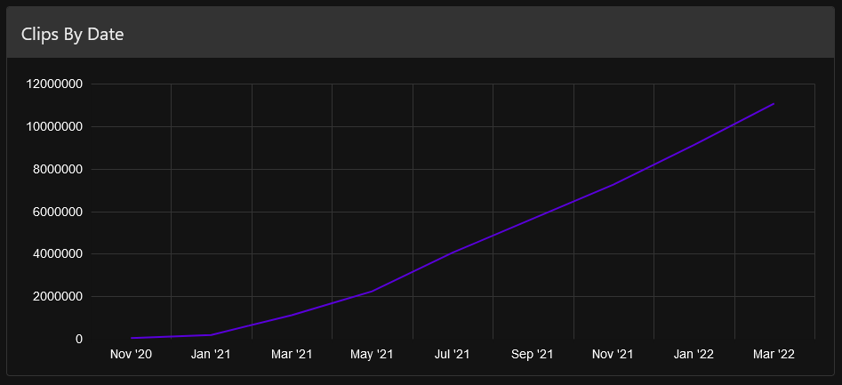
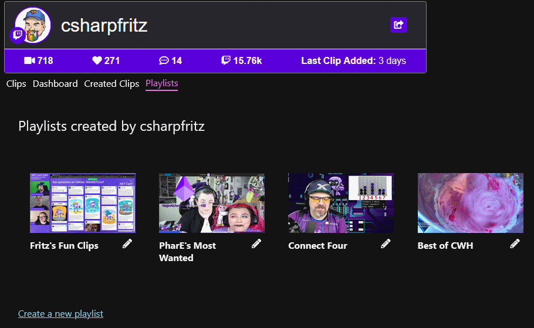
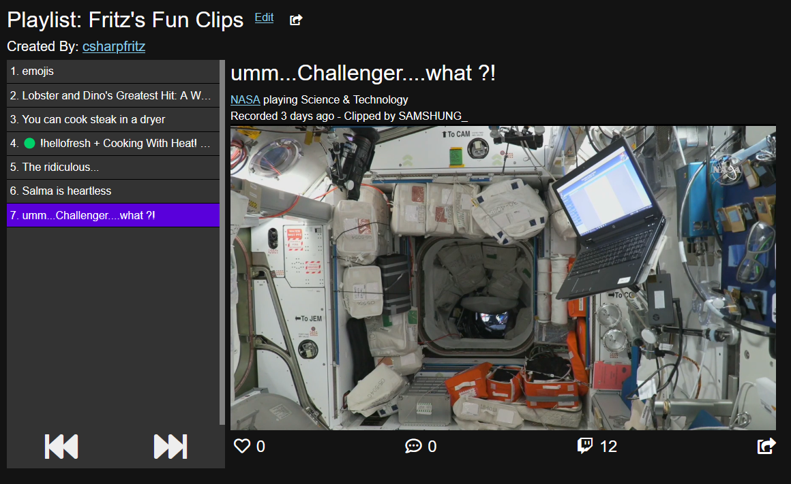
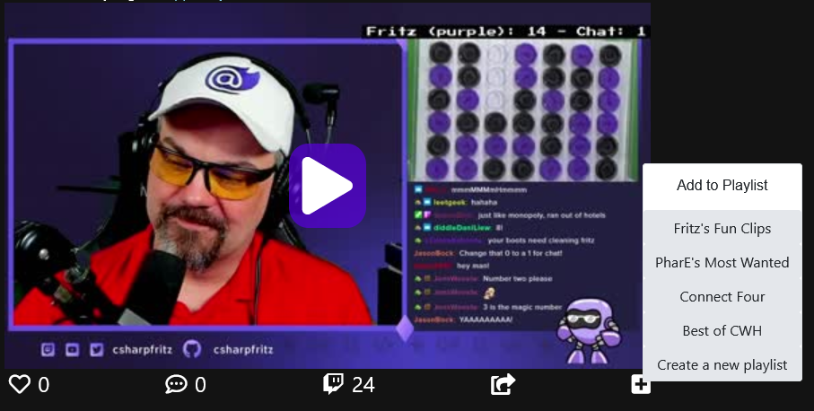
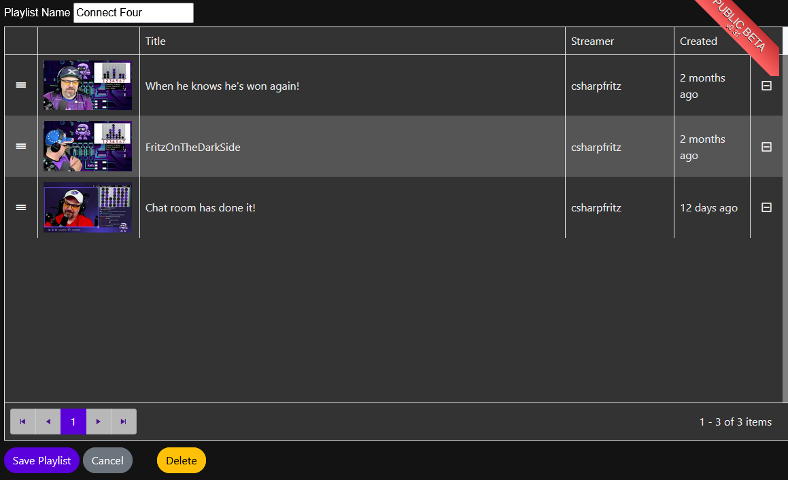
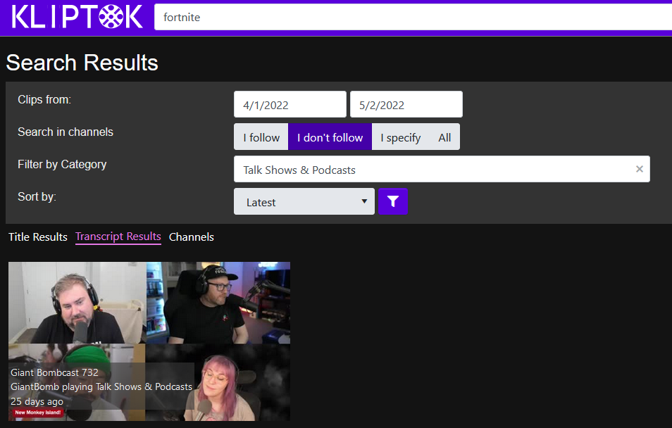
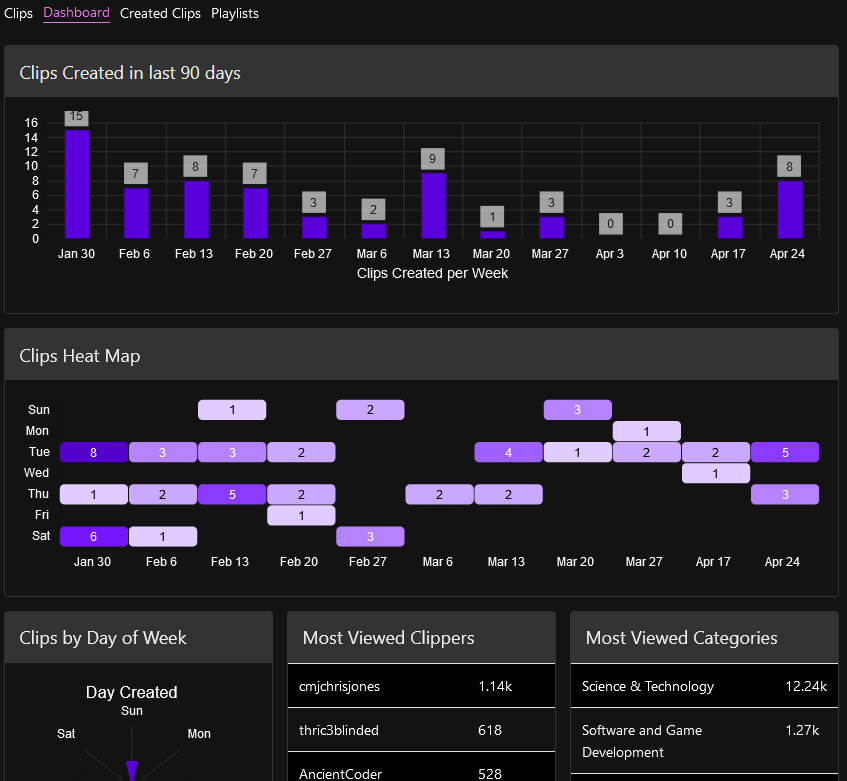
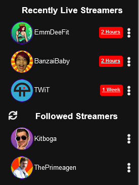
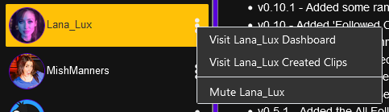
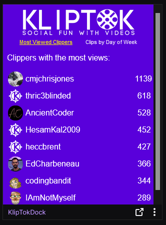

It's been a long while since we've published an update about KlipTok, and there's a lot to document that's happened since.  More clips, more features, architecture changes and cool new features we're planning.

Let's first talk about growth.  KlipTok indexes a LOT of clips

## 11 Million clips!

We've crossed more than 11 million clips that have been indexed on the site.  This is a jump of 9 million clips since May 2021, an 550% increase in data over that time.  We're thrilled to see the growth in content, and want to encourage more folks to try KlipTok.  There's a great catalog of channels, clips, and transcriptions for you to explore.

For those that are interested, this accounts for about 50GB of database storage.

## Latest Feature - Playlists

Among the cool and unique features on KlipTok, you can now login with your Twitch account and create Playlists of clips from any channel.  By grouping together these clips, you can share your playlists for others to view or to collect special memories almost like a "photo album".

Each user has their own collection of playlists, available from their streamer page or from the menu hiding under your profile picture.

Unlike other Twitch clips, these clips pay back to back to back with no advertising or pausing between videos.  It's a non-stop video of Twitch shenanigans!

You can get started creating and adding clips to a playlist just by logging in and clicking the + at the bottom-right of any clip you'd like to add to a playlist.

If you want to change the order of clips on your playlists, or remove clips from the playlist, you can click the edit button on the Playlists page or the playlist itself.

You can then share your playlists with the 'Share button' at the top of the playlist page, right next to the 'Edit' button.

Have fun with playlists, they're a great way to group together some of your favorite videos and share with your friends.

## Search Improvements

KlipTok's search feature keeps getting better.  With this update, you can now filter search results by channels you follow or don't follow or even a specified list of channels you want to search, as well as filtering based on a Twitch category.  

KlipTok's _**EXCLUSIVE**_ search across transcriptions of clips continues to grow.  We're adding new channels to the transcription feature and hope to see this continue to improve with our partner [AssemblyAI](https://assemblyai.com)

## Streamer Dashboard Improvements

Have you wondered when the most clips are being generated for your channel?  Who are the folks creating the most watched clips? 

We've added some updates to the streamer dashboard on your streamer page, just click the 'Dashboard' link at the top (or button at the bottom of your mobile web browser) and you can see the clips created over the last 90 days, a heat map of when the clips were created, and more details about who is creating clips.

All of these entries in the bar charts, heat map, and lists or clippers and categories are all clickable so that you can search for JUST those clips.

## Live Channels and Sidebar Refresh

We've added 'now live' indicators to the KlipTok sidebar as well as a block of up to 4 channels that recently went live, regardless of whether those 4 channels have clips.  In this way, you can see which of the channels you enjoy are live and how long they've been live.  

We're continuing to show the links to the channels you follow that had the most recent clips created, in the lower third of the sidebar.

If other streamers in the Suggested and Followed channels sections are live as well, they will also display a similar 'live indicator'.  All of the live indicators can be clicked to jump right to that channel on Twitch.

The sidebar now updates every 2 minutes, refreshing the list of Suggested Streamers and updating the 'Recently Live Streamers' section with up to date information about who recently went live.

We've also added some menus on the sidebar as kabob menus that allow you to jump to that channel's dashboard, the clips that streamer has created, or to mute the channel.

## Database Updates

In August 2021, we started a long process to update the KlipTok database to [RavenDb](https://ravendb.net).  RavenDb gives KlipTok a NoSQL style storage engine, complete with full-text search and adaptive indexes.  RavenDb is such a smart database that when it sees things are running slow it builds a new index to make things FASTER.

We're currently running KlipTok on RavenDb Cloud in an Azure datacenter on 3 nodes for redundancy.

We'll publish more details about the migration to RavenDb in the weeks ahead.

## Twitch Integrated Panel

You can now add KlipTok to your Twitch channel!  We built and deployed an extension to Twitch that shows the clips created by day of week and the folks from your Twitch community that have created the most viewed clips on your channel.

Look for the [KlipTokDock extension on Twitch](https://dashboard.twitch.tv/extensions/eakutjhdwh3m1p7vd7uodnvweuhzmz-0.2.0) to add this panel to your channel.

## Summary

We've added a LOT of features to KlipTok over the last few months and have not spent as much time promoting and sharing those features on this blog.  We're going to get back to that and share more in the months ahead.

We're about to start work on a discovery algorithm to help recommend new clips and streamers on Twitch that we think you'll enjoy.  This algorithm will be built with ML.NET, Azure Functions, and RavenDb.

Take a look at [KlipTok](https://kliptok.com) and explore some of the great Twitch clips that we have indexed for you.